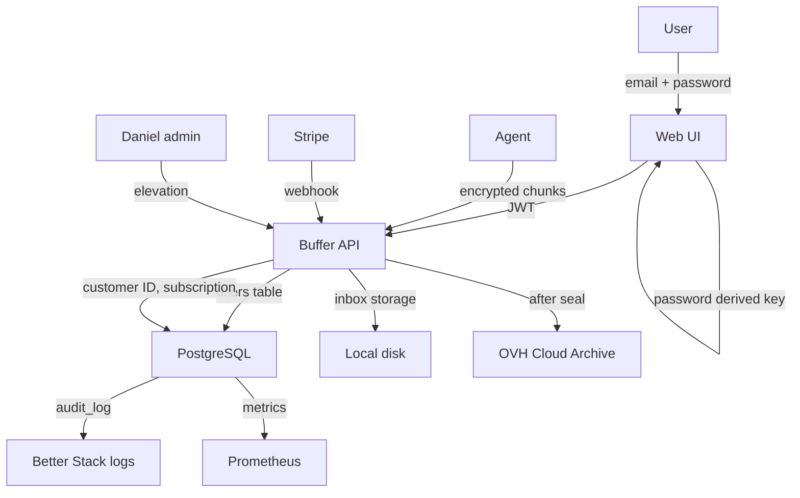

# Crypto & Compliance — Master Plan

Wersja: 1.0 (initial, pre-prod)
Repo: `properbackup-shared` (crypto), `properbackup-buffer` (data flow), `properbackup-docs/legal/`
Status: SPEC — czeka na implementacje przez kolejnego agenta
Priorytet: **P2**

---

## 1. Cel dokumentu

Single source of truth dla wszystkich aspektow **kryptografii klient-side i zgodnosci prawnej** (RODO/GDPR, DPA, polityka prywatnosci, art. 32 GDPR, data flow).

**WAZNE:** Sama implementacja kryptografii (klasy `ProperCrypto`, `KeyDerivation`, `HeaderCodec`) jest **READ-ONLY** (zamrozona). Ten dokument **opisuje i weryfikuje** istniejacy stan i dodaje brakujace warstwy: compliance docs, audit procedures, data subject request handling, key escrow strategie.

Brat dokumentu `master-tdd-plan.md`, `buffer-core-master-spec.md`, `observability-and-dr-spec.md`.

### Co JEST w zakresie

- Audit istniejacej implementacji crypto (verify nie modify)
- RODO art. 32 (technical and organizational measures) compliance doc
- DPA (Data Processing Agreement) template dla B2B
- Privacy policy template (GDPR-compliant)
- Data flow diagram (gdzie laduja dane osobowe vs metadane vs files)
- "User requests data deletion" workflow (art. 17)
- "User requests data export" workflow (art. 20)
- Key escrow strategia (master key dla DR, ale ZERO knowledge claim management)
- Audit log integrity (tamper-proof)

### Co NIE jest w zakresie

- Zmiana istniejacych algorytmow szyfrowania (zamrozone)
- Generowanie nowych klucy dla istniejacych userow (post-MVP, audit ma sens dla nowych)
- HSM (Hardware Security Module) — post-MVP
- FIPS 140-2 certyfikacja — post-MVP
- ISO 27001 audit — post-MVP

---

## 2. Mapowanie kodu

### 2.1 Kluczowe klasy (READ-ONLY)

| Klasa | Plik | Rola | Status |
|-------|------|------|--------|
| `ProperCrypto` | `properbackup-shared/.../core/crypto/ProperCrypto.kt` | AES-256-GCM encrypt/decrypt | **ZAMROZONE** |
| `KeyDerivation` | `properbackup-shared/.../core/crypto/KeyDerivation.kt` | Argon2id KDF | **ZAMROZONE** |
| `HeaderCodec` | `properbackup-shared/.../core/crypto/HeaderCodec.kt` | Chunk header layout | **ZAMROZONE** |
| `Base62` | `properbackup-shared/.../core/codec/Base62.kt` | pathId encoding | **ZAMROZONE** |
| `ProperCodec` | `properbackup-shared/.../core/codec/ProperCodec.kt` | Generic codec | **ZAMROZONE** |
| `FilenameGrammar` | `properbackup-shared/.../core/filename/FilenameGrammar.kt` | Filename validation | **ZAMROZONE** |

### 2.2 Personal data lokalizacja (audit)

Pre-audit checklist (przyszly agent sprawdzi):

| Tabela / lokalizacja | Personal data | Plain / Encrypted | Risk |
|----------------------|---------------|-------------------|------|
| `users.email` | Email | **PLAIN** | High (used for login + comm) |
| `users.encryption_password` | User password / key | **HASHED?** (sprawdz!) | Critical |
| `users.last_login_ip` | IP | **PLAIN?** | Medium |
| `users.last_login_at` | Timestamp | PLAIN | Low |
| `audit_log.actor` | userId | PLAIN | Low (pseudonym) |
| `audit_log.metadata.ip` | IP | PLAIN? | Medium |
| Logs (`/var/log/...`) | Stack traces | PLAIN | Medium (sprawdz filters) |
| `agent_metrics` | Machine name | PLAIN | Low |
| `servers.machine_name` | "Production VPS #1" | PLAIN | Low (jezeli sam user wybiera) |
| OVH objects | File content | **ENCRYPTED** (good) | - |
| OVH headers `X-Object-Meta-*` | Path hashes | HASHED (good) | - |

### 2.3 Kluczowe pliki dokumentow do utworzenia

| Plik | Status |
|------|--------|
| `properbackup-docs/legal/privacy-policy.md` | **NEW** (template) |
| `properbackup-docs/legal/dpa-template.md` | **NEW** (DPA for B2B) |
| `properbackup-docs/legal/data-flow-diagram.md` | **NEW** |
| `properbackup-docs/legal/gdpr-art-32-compliance.md` | **NEW** |
| `properbackup-docs/legal/data-subject-request-procedure.md` | **NEW** |
| `properbackup-docs/legal/audit-log-integrity.md` | **NEW** |
| `properbackup-docs/legal/breach-notification.md` | **NEW** (art. 33/34) |

---

## 3. DOTYKAJ vs NIE RUSZAJ

### NIE RUSZAJ (absolutnie zamrozone)

- `ProperCrypto.kt` — algorytm, parametry, IV generation
- `KeyDerivation.kt` — Argon2id parametry (m, t, p)
- `HeaderCodec.kt` — chunk header binary layout
- `Base62.kt`, `ProperCodec.kt`
- `FilenameGrammar.kt`
- Wszystkie istniejace migrations w `schema.sql`
- `JwtService.kt`, `JwtFilter.kt`

### DOTYKAJ (ostroznie)

- `users` tabela — DODAJ kolumny (dla GDPR fields: `marketing_consent_at`, `tos_accepted_version`, `gdpr_deletion_requested_at`)
- `audit_log` — dodaj nowe akcje (`gdpr_export_requested`, `gdpr_deletion_requested`, `password_changed`)
- Logback config — dodaj filters dla maskowania sekretow
- `properbackup-buffer/.../auth/` — dodaj data subject request endpoints

### MOZESZ TWORZYC

- `properbackup-docs/legal/*.md` — wszystkie compliance docs
- `properbackup-buffer/.../gdpr/GdprController.kt` — endpointy /gdpr/export, /gdpr/delete
- `properbackup-buffer/.../gdpr/DataExporter.kt`
- `properbackup-buffer/.../gdpr/DataDeleter.kt`
- `properbackup-stack/scripts/gdpr-purge.sh` — cron daily
- `properbackup-web/.../settings/PrivacyPage.jsx`
- `properbackup-web/.../settings/DataExportPage.jsx`

---

## 4. Domain Model — Compliance Architecture

### 4.1 Trzy klasy danych

Każde dane w systemie ProperBackup nalezy zaklasyfikowac do jednej z trzech klas:

#### Klasa A: Dane osobowe (PII)

- `users.email`
- `users.last_login_ip` (jezeli logujemy)
- `audit_log.metadata.ip`
- Adresy IP w nginx logs
- Email recipients (subscriptions, dunning, alerts)

**Wymagania:**
- Encryption at rest (PG TDE lub pg_crypto kolumny — sprawdz)
- Encryption in transit (TLS 1.3)
- Audit log dla read access przez admina
- Retencja: tak dlugo jak konto aktywne + 7 lat (ksiegowosc)
- Po deletion request: hard delete w 30 dni (art. 17)

#### Klasa B: Pseudonimizowane dane

- `paths_index.path_id` (Base62 hash of original_path + server_id)
- `archive_snapshot.chunk_id` (UUID)
- `agent_metrics.machine_id` (UUID nadany przy aktywacji)
- `X-Object-Meta-User-Hash` w OVH (sha256 userId)

**Wymagania:**
- Same w sobie nie sa osobowe (nie da sie zidentyfikowac usera bez DB)
- Mozliwosc re-identyfikacji w polaczeniu z `users` table → traktuj jako Klasa A "by extension"

#### Klasa C: Encrypted user data (treść backupow)

- Plik content w OVH (AES-256-GCM zaszyfrowane)
- Header chunkow

**Wymagania:**
- Klucz NIE jest dostepny dla ProperBackup (zero-knowledge claim)
- Decryption tylko klient-side (agent ma klucz, web ma klucz tylko dla restore w przegladarce)
- ProperBackup widzi sieci/metadata ale nie content

### 4.2 Crypto contract (audit istniejacego)

**Przyszly agent musi zweryfikowac:**

#### A. ProperCrypto.kt

```kotlin
// Spodziewany algorytm:
// AES-256-GCM
// Klucz 32 bytes (256 bit)
// IV 12 bytes (96 bit) — generated per chunk z CSPRNG
// Tag 16 bytes (128 bit)
// AAD: optional, sprawdz uzycie

// Spodziewany API:
// fun encrypt(plaintext: ByteArray, key: ByteArray, aad: ByteArray?): ByteArray
// fun decrypt(ciphertext: ByteArray, key: ByteArray, aad: ByteArray?): ByteArray

// Verify:
// - IV nigdy nie reuse (CSPRNG, nie counter)
// - Tag walidowane przed deshyfrowaniem (auth before decrypt)
// - Constant-time comparison na error paths (no timing attack)
```

**Action items dla audytu:**
- Test: 10K encryptions z tym samym kluczem → 10K rozne IVs (no collision)
- Test: bit flip w ciphertext → InvalidTagException (not silent corruption)
- Test: bit flip w tag → InvalidTagException
- Test: bit flip w IV → bad tag → exception

#### B. KeyDerivation.kt

```kotlin
// Spodziewany algorytm: Argon2id
// Parametry (sprawdz aktualne):
//   m (memory): >= 64 MB
//   t (iterations): >= 3
//   p (parallelism): 1-2
//   saltLen: 16 bytes
//   outputLen: 32 bytes

// Verify:
// - Salt unique per derivation
// - Time/memory params OWASP recommended (zmiany od 2026: sprawdz)
```

**Action items:**
- Test: derivation time na typowym hardware (laptop) ~ 500ms (akceptowalne UX)
- Test: derivation z identycznym hasłem + salt → identyczny key
- Test: derivation z identycznym hasłem + rozny salt → różny key

#### C. HeaderCodec.kt

```
Spodziewany format (sprawdz):
┌──────────────────────────────────────────────────────────┐
│ Magic bytes "PB" (2B)                                     │
│ Version (1B)                                              │
│ Flags (1B): includes_aad, etc.                            │
│ IV length (1B) + IV bytes                                 │
│ Salt length (1B) + Salt bytes                             │
│ Tag length (1B) + Tag bytes                               │
│ AAD length (4B) + AAD bytes (optional)                    │
│ Ciphertext length (8B) + Ciphertext bytes                │
└──────────────────────────────────────────────────────────┘
```

**Action items:**
- Header parsing rejects malformed (PayloadGuard w bufferze)
- Magic bytes check
- Version checking (forward compat)

### 4.3 Key lifecycle

```
1. Generation (przy rejestracji)
   - User registers w UI
   - Web: generuj password klient-side (web-crypto API)
   - Web: derive key via Argon2id z salt
   - Web: store key tylko w sessionStorage (NIE localStorage, NIE wysylac do buffera!)
   - Web: szyfruj recovery hint (np. test phrase) z key, wysylaj do buffera
     - Buffer storuje: encrypted recovery hint + salt (NIE klucz)
   
2. Login (powrot uzytkownika)
   - User wprowadza password
   - Web fetchuje salt z buffera
   - Web: derive key (Argon2id)
   - Web: probuje deszyfrowac recovery hint
     - Sukces → key correct
     - Fail → invalid password
   - Web: store key in sessionStorage

3. Agent activation
   - User aktywuje agenta z token
   - Agent: get encrypted user-password-derived-key z buffera? Lub:
   - Web: pokazuje user encryption key (one-time, "save this!")
   - Agent: prompt user wprowadz klucz (lub przeklejony z aktywacji UI)
   - Agent: store klucz w global config (zaszyfrowanym keychain-owym mechanizmem OS jezeli mozliwe)

4. Backup
   - Agent uses klucz to encrypt chunk
   - Buffer NIE widzi plaintext, NIE widzi klucza

5. Restore
   - User w web, klucz w sessionStorage
   - Web pobiera ciphertext z buffer
   - Web deszyfruje (client-side)
   - Plik save'owany lokalnie

6. Password change
   - User w UI zmienia password
   - Web: derive NEW key z NEW password
   - Web: re-encrypt recovery hint z NEW key
   - PUT /auth/recovery-hint with new encrypted hint
   - OLD klucz nadal valid (stare backupy szyfrowane starym kluczem)
   - **Klient sam decyduje:** dalsza nowe backupy z nowym kluczem (i ma 2 klucze do trzymania)
   - LUB: re-encrypt wszystkie backupy (drogie, opcja w UI "re-encrypt all" — post-MVP)

7. Lost password
   - User nie zna password
   - Web: PURGE all data (recovery NIE jest mozliwe)
   - User dostaje opcje "Reset password = stracic wszystkie backupy" (twardy choice)
   - **Alternatywa:** key escrow (Section 4.4)
```

### 4.4 Key escrow (opcjonalna, opt-in)

**Problem:** Zero-knowledge oznacza ze utracony password = utracone wszystkie backupy.

**Rozwiazanie opt-in:** User w UI zaznacza "Enable key escrow" → klucz zaszyfrowany **master public key** (ProperBackup ma private master key offline) → store w bufferze.

**Tradeoff:**
- Z escrow: ProperBackup MOZE odzyskac dane (klient daje permission)
- Bez escrow: ProperBackup NIE MOZE (zero-knowledge utrzymany)

**Default:** Escrow OFF (zero-knowledge wieksza wartość privacy)

**Implementacja (post-MVP):**
- Master key generated offline na laptop Daniela
- Private key na 1Password (3 backupy: 1Password, drukowany QR, USB)
- Public key embeded w buffer source code
- Recovery procedure: klient -> support -> Daniela offline laptop -> manual decrypt

### 4.5 Data subject request (DSR) — art. 15-22

7 prawa user'a (Polish RODO / EU GDPR):

| Art. | Prawo | Obowiazek systemu |
|-----|------|------------------|
| 15 | Right to access | Export wszystkich danych user'a (GET endpoint) |
| 16 | Right to rectification | Edit fields (email, etc.) w settings page |
| 17 | Right to erasure | Delete account + cascade |
| 18 | Right to restriction | Pause processing (e.g., pause backups) |
| 20 | Right to data portability | Export w machine-readable format (JSON) |
| 21 | Right to object | Opt-out marketing |
| 22 | Automated decision-making | (nie mamy w ProperBackup) |

**Procedury — Section 5 (test groups).**

---

## 5. Test Groups

Numerowanie `[CRY-Xn]`.

### Grupa A: Crypto audit (verify only, NIE modify)

#### `[CRY-A1]` IV uniqueness audit

**Cel:** Pewnosc ze IV jest unique per encryption.

**Test:**
```kotlin
@Test
fun `IV unique across 10000 encryptions`() {
  val key = randomKey()
  val ivs = (1..10000).map {
    val ciphertext = ProperCrypto.encrypt("hello".toByteArray(), key, null)
    HeaderCodec.parse(ciphertext).iv
  }.toSet()
  assertEquals(10000, ivs.size)  // No collisions
}
```

**DoD:**
- Test added jako `properbackup-shared/.../core/crypto/PropertyCryptoAuditTest.kt`
- Test passes
- Test w CI permanently

#### `[CRY-A2]` Tag verification before decrypt

**Cel:** Decrypt rzuca exception przed expose plaintext gdy tag jest wrong.

**Test:**
- Encrypt "secret message"
- Flip bit w tag bytes
- Decrypt → expect InvalidTagException (NIE silent corrupted plaintext)

**DoD:**
- Test passes
- Stack trace nie zawiera plaintextu

#### `[CRY-A3]` Constant-time tag comparison

**Cel:** Tag comparison uses constant-time (no timing leak).

**Test:**
- Timing test: 10K trials z right tag i 10K z wrong tag
- Median timing nie powinien różnic sie statystycznie

**DoD:**
- Stat test passes (p-value > 0.05)
- Note: trudny test, akceptujemy jezeli `MessageDigest.isEqual` lub `Arrays.equals` jest uzywany (sprawdz)

#### `[CRY-A4]` Argon2id parameters audit

**Cel:** Parametry sa rozsadne (OWASP 2026).

**Verify (z `KeyDerivation.kt`):**
- m (memory) >= 64 MB (OWASP 2024: 19 MB, 2026 zalecane 64 MB)
- t (iterations) >= 3
- p (parallelism) 1 lub 2

**Action:** Jezeli parametry niezgodne, **NIE zmieniaj** (zamrozone), ale dokumentuj w `gdpr-art-32-compliance.md` z uzasadnieniem (UX vs security).

**DoD:**
- Audit dokumentowany
- Benchmark: derivation 500ms ± 200ms na laptop

#### `[CRY-A5]` Forward secrecy review

**Cel:** Jezeli klient password leakuje, czy stare backupy sa nadal bezpieczne?

**Decyzja:** Klient password = key, jezeli leaknie → wszystkie chunki (past i future) sa odszyfrowywalne.

**Wniosek:** Nie mamy forward secrecy w obecnym modelu.

**Mitigation:**
- Klient password change → derive new key, ale stare chunki nadal stare-key
- Optional re-encrypt (post-MVP)
- Dokumentuj w `gdpr-art-32-compliance.md`

### Grupa B: Data flow & RODO art. 32

#### `[CRY-B1]` Data flow diagram

**Cel:** Plik `properbackup-docs/legal/data-flow-diagram.md` z mermaid diagrammem:



**Klasyfikacja danych w diagramie:**
- PII flows w czerwonym
- Pseudonymized flows w pomaranczowym
- Encrypted user data w zielonym
- Sekrety (klucze, tokeny) flows w niebieskim z ostrzezeniem

**DoD:**
- Plik utworzony, mermaid renderuje sie poprawnie
- Każdy bok strzalka oznaczony klasa danych
- Linked z `gdpr-art-32-compliance.md`

#### `[CRY-B2]` RODO art. 32 compliance doc

**Plik:** `properbackup-docs/legal/gdpr-art-32-compliance.md`

**Sekcje (template):**

```markdown
# RODO art. 32 — Bezpieczenstwo przetwarzania

## Tytulem wstepu

ProperBackup przetwarza dane osobowe userow (email, IP) oraz dane szyfrowane userow (backup content w postaci nieczytelnej dla operatora).

## Srodki techniczne (art. 32 ust. 1 lit. a)

### Szyfrowanie

- **At rest (OVH):** Wszystkie backup chunki sa szyfrowane AES-256-GCM kluczem klient-derived (Argon2id z passwordem klienta)
- **In transit:** HTTPS TLS 1.3 dla wszystkich polaczen (buffer-agent, buffer-web)
- **PostgreSQL:** TBD (decision pending: PG TDE vs application-level encryption dla wrazliwych kolumn)

### Pseudonimizacja

- `paths_index` zamiast plaintext path
- `chunk_id` UUID zamiast file metadata
- `X-Object-Meta-User-Hash` (sha256 userId) zamiast plain userId w OVH

### Hashed credentials

- Passwordy w `users.password_hash` z Argon2id (sprawdz)
- Stripe customer ID — pseudonimizowany

## Srodki organizacyjne (art. 32 ust. 1 lit. b)

### Dostęp

- Admin (Daniel) elevation flow z one-time seed code
- Audit log każdy admin access
- Brak shared accounts

### Audit log

- Append-only `audit_log` table
- 7-letnia retencja
- Sha256 chain dla tamper-detection (`[CRY-D1]`)

## Test odpornosci (art. 32 ust. 1 lit. d)

- Quarterly chaos drill: restore z OVH, baza padla
- Monthly security review (manual)
- CI: secret scanning, dependency scanning

## Naruszenie ochrony (art. 33-34)

Patrz: `breach-notification.md`
```

**DoD:**
- Plik utworzony
- Linked z PR
- Daniel review

#### `[CRY-B3]` Logback secret filter

**Cel:** Stack traces, log messages NIGDY nie zawieraja kluczy/passwordow/tokenow.

**Implementacja:**
```xml
<!-- logback.xml -->
<appender ...>
  <encoder class="...PatternLayoutEncoder">
    <pattern>%d %p [%t] %c - %msg%n</pattern>
  </encoder>
  <filter class="...SensitiveDataFilter">
    <patterns>
      <pattern>(?i)(password|secret|key|token|authorization)\s*[=:]\s*['"]?([^\s'",]+)['"]?</pattern>
      <replacement>$1=*****</replacement>
    </patterns>
  </filter>
</appender>
```

**DoD:**
- Test: log message `Failed to validate token=abc123` → output `Failed to validate token=*****`
- Test: `Authorization: Bearer eyJ...` → `Authorization: Bearer *****`
- CI scan logs po test run → 0 detected secrets

### Grupa C: Data subject requests

#### `[CRY-C1]` Data export (art. 20)

**Cel:** User w UI klika "Download my data" → zip z:
- `account.json` — email, plan, created_at, etc.
- `audit_log.json` — historic actions
- `servers.json` — list serverow
- `snapshots.csv` — lista wszystkich backupow (metadata)
- `usage.csv` — daily storage usage per month
- `chunks/` — encrypted backup files (note: klient sam musi decrypt)

**Endpoint:** POST /gdpr/export → async job → email z link gdy ready (lub UI poll)

**Pliki:**
- NEW: `properbackup-buffer/.../gdpr/DataExporter.kt`
- NEW: `properbackup-web/.../settings/DataExportPage.jsx`

**DoD:**
- Export wykonany w <30 min dla typowego usera (100 GB data)
- Zip parses validly (ZipFile.entries())
- account.json zawiera wszystkie pola wymagane przez art. 20
- Test "concurrent export requests" — limit 1 per user (drugi: 429)
- Audit log entry

#### `[CRY-C2]` Data deletion (art. 17)

**Cel:** User klika "Delete my account" → 7-dniowy grace period → hard delete.

**Implementacja:**
- POST /gdpr/delete-account
- INSERT `gdpr_deletion_requests` z `executed_at = now() + interval '7 days'`
- UI: "Your account will be deleted on 2026-06-02. Cancel anytime."
- Email confirm
- Cron daily: `gdpr-purge.sh` wykonuje:
  - DELETE users WHERE id = ... CASCADE (wszystkie powiazane tabele)
  - DELETE wszystkie OVH objects z X-Object-Meta-User-Hash = sha256(userId)
  - DELETE Stripe customer (Stripe API)
  - Audit log: "user_deleted: {hash(userId), email_hash, deletion_reason}"

**Pliki:**
- NEW: `properbackup-buffer/.../gdpr/DataDeleter.kt`
- NEW: `properbackup-stack/scripts/gdpr-purge.sh`

**Edge cases:**
- User cancels w 6 dniu → DELETE FROM gdpr_deletion_requests (no hard delete)
- User cancels w 8 dniu (juz przetworzone) → 410 Gone, "Account already deleted"
- Cascade fails mid-execution → audit log "partial_deletion", manual recovery procedure

**DoD:**
- E2E test full flow
- Test "cancel w 6th day" → konto przywrocone
- Test "concurrent deletion" → 1 succeeds, 1 fails
- OVH cleanup verified (manual: spr listing per X-Object-Meta-User-Hash)

#### `[CRY-C3]` Marketing opt-out (art. 21)

**Cel:** User klika "Unsubscribe from marketing emails".

**Implementacja:**
- UPDATE users SET marketing_consent_at = NULL
- Brak emails marketingowych (poza essential transactional: invoice, password reset, dunning)

**DoD:**
- Test wykluczone z marketing list
- Test ze transactional dalej dziala

#### `[CRY-C4]` Data rectification (art. 16)

**Cel:** User edytuje email/imie w settings.

**Implementacja:** (cross-ref `web-panel-master-spec.md` 6.13)

#### `[CRY-C5]` Restriction (art. 18)

**Cel:** User chce wstrzymac przetwarzanie ale nie kasowac.

**Implementacja:**
- `users.processing_paused_at` kolumna
- Gdy paused: agent dostaje 403 PROCESSING_PAUSED na upload
- Stare dane zostaja accessible (restore mozliwe)
- User klika "Resume" → paused_at = NULL

**DoD:**
- E2E test pause -> upload blocked -> resume -> upload działa

### Grupa D: Audit log integrity

#### `[CRY-D1]` Audit log tamper detection

**Cel:** Audit log entries chronologicznie chained sha256 hash. Modyfikacja starego wpisu psuje chain.

**Implementacja:**
```sql
ALTER TABLE audit_log ADD COLUMN prev_hash CHAR(64);
ALTER TABLE audit_log ADD COLUMN entry_hash CHAR(64);

-- W trakcie INSERT:
-- entry_hash = sha256(prev_hash || actor || action || metadata || created_at)
-- prev_hash = last entry's entry_hash
```

**Verify procedure:**
```bash
# Re-compute chain
psql -c "SELECT verify_audit_chain()" 
# Returns boolean — true if chain intact
```

**Pliki:**
- DOTYKAJ: `schema.sql` — dodaj kolumny + trigger lub PG function
- NEW: `properbackup-stack/scripts/verify-audit-chain.sh`

**DoD:**
- Insert 100 entries → chain valid
- Manual UPDATE w sredku → verify returns false, alert
- Cron weekly verify

#### `[CRY-D2]` Audit log export immutable

**Cel:** Daily export audit_log do B2 (separate bucket, write-only credentials).

**Po co:** Atakujacy z bufferem can wipe audit_log; ale ze nie ma write access do B2 archive → forensics ma kopie.

**Implementacja:**
- Cron daily: `pg_dump --table=audit_log --where="created_at >= now()-interval '1 day'"`
- Encrypt z master public key
- rclone copy do B2 bucket `properbackup-audit-archive`
- B2 retention policy: 7 lat (RODO ksiegowosc)

**DoD:**
- Daily run successful
- Test "buffer compromised → wipe audit_log → ostatnia kopia w B2 dostepna"

#### `[CRY-D3]` Admin action audit

**Cel:** Każdy `/admin/*` request audit logged z:
- `actor: admin@properbackup.pl`
- `action: 'manual_subscription_upgrade'`
- `target: userId`
- `metadata: {reason, original_value, new_value, ip}`

**Pliki:**
- DOTYKAJ: All admin handlers — middleware `AuditAdminAction`

**DoD:**
- Test każdy /admin endpoint generuje audit
- Test bez audit-aware middleware → fail (gate)

### Grupa E: Breach notification (art. 33-34)

#### `[CRY-E1]` Breach detection procedures

**Plik:** `properbackup-docs/legal/breach-notification.md`

**Sekcje:**
- Co kwalifikuje sie jako naruszenie:
  - Unauthorized access do PII
  - Encrypted data exposure (PG dump leaked)
  - Stripe webhook secret leaked
  - OVH credentials leaked
  - Admin account compromised
- Procedura:
  1. Detection: Better Stack alert / user report / pen test
  2. Triage (within 1h): severity (P0/P1/P2)
  3. Containment (within 4h): rotate credentials, block access
  4. Investigation: scope determination
  5. Notification:
     - **Within 72h: UODO** (Polish DPA) jezeli "high risk to rights/freedoms"
     - **Within reasonable time: affected users** jezeli "high risk"
  6. Documentation: full breach report (internal + UODO copy)
- Templates:
  - Email do affected users (Polish + English)
  - UODO notification form (link do form)

**DoD:**
- Plik utworzony
- Daniel signed off
- Linked z `gdpr-art-32-compliance.md`

#### `[CRY-E2]` Annual security audit

**Cel:** Raz na rok external pen-test (post-MVP) lub manual review.

**Implementacja MVP:**
- Manual checklist co Q1: passwords rotated, deps updated, audit chain verified, breach docs reviewed
- Q4: cytoda ze pen-test budgetowany na nastepny rok (gdy revenue pozwala)

**DoD:** Checklist plik utworzony, Q1 2027 wpis w kalendarzu.

### Grupa F: B2B / DPA

#### `[CRY-F1]` DPA template

**Plik:** `properbackup-docs/legal/dpa-template.md`

**Status:** Tylko dla B2B Enterprise klientow (post-MVP wlaszcz, ale szablon przygotowany).

**Sekcje (RODO art. 28):**
1. Subject matter and duration
2. Nature and purpose
3. Type of personal data
4. Categories of data subjects
5. Obligations of processor (ProperBackup)
6. Sub-processors (OVH, Stripe — listowane)
7. International transfers (OVH GRA = EU; brak transferu poza EU)
8. Technical and organizational measures (link do `gdpr-art-32-compliance.md`)
9. Audit rights klienta
10. Data return / deletion procedures
11. Liability

**DoD:**
- Plik utworzony jako Markdown
- Generator skrypt: `properbackup-docs/scripts/generate-dpa.sh <klient_name>` → PDF z dane klienta wypelnione
- Linked z B2B landing page (post-MVP)

#### `[CRY-F2]` Sub-processor list

**Plik:** `properbackup-docs/legal/sub-processors.md`

| Sub-processor | Funkcja | Dane przekazywane | DPA z nim |
|---------------|---------|-------------------|-----------|
| OVH Cloud (FR) | Cloud Archive storage | Encrypted backups, X-Object-Meta-* hashes | OVH DPA (standard) |
| Stripe (IE, EU branch) | Payment processing | Email, payment data | Stripe DPA |
| Better Stack (CZ) | Logs/monitoring | Application logs (filtered sekrety) | BS DPA |
| Cloudflare | CDN/DNS (jezeli używasz) | IP addresses | CF DPA |
| Resend / SendGrid (jezeli email) | Transactional emails | Email content + recipient | Provider DPA |

**Update procedure:** Dodanie nowego sub-processora → 30-dniowy advance notice do B2B klientow.

**DoD:**
- Plik utworzony
- Cron quarterly: review wpis, sprawdz czy lista aktualna

---

## 6. Edge Cases (15+)

### 6.1 Klient gubi password

User klika "Forgot password" — bez recovery → konto deletable, dane permanently lost.

**Wymagane:** Komunikat klarowny przed flow: "Reset password = utrata wszystkich backupow"

### 6.2 Email verification bypass

User rejestruje sie z `valid@example.com` ale nigdy nie potwierdza email.

**Wymagane:**
- 7 dni grace na email verify
- Po 7d: konto disabled, ale backup zachowane (jezeli juz cos uploadowany)
- Po 30d bez verify: hard delete (cross-ref `[BUF-H2]`)

### 6.3 Multi-language privacy policy

UE wymaga policy w jezykach krajow targetowanych.

**Wymagane:**
- Polish privacy-policy + English fallback
- Future: DE, FR (jezeli expand)
- Each language: identyczna tresc, tylko jezyk

### 6.4 Cookies (web)

Web panel uzywa LocalStorage / sessionStorage. Cookies (jezeli auth via cookie) wymagaja banner.

**Audit:**
- Sprawdz uzycie cookies w `AuthContext.jsx` (HttpOnly cookie?)
- Jezeli tak: cookie banner + consent
- Jezeli brak (tylko Authorization header): brak cookie banner needed (Necessary only)

### 6.5 Third-party analytics

Plausible Analytics (jezeli uzywamy) — GDPR-friendly bez cookie.
Google Analytics → wymaga consent + IP anonymization.

**Decyzja:** Plausible (no GDPR overhead) lub brak analytics MVP.

### 6.6 Backup encrypted z weak password (np. "123456")

User wybiera słabe haslo, klucz Argon2id bedzie weak.

**Wymagane:**
- Frontend zod validation: min 12 chars, mix lowercase/uppercase/digit/special
- haveibeenpwned check (k-anonymity api) — opcjonalne
- Komunikat: "Password musi spelniac wymagania"

### 6.7 Klient downloaduje historie audit log

Klient klika "Export my data" → audit_log entries z metadata.ip.

**Wymagane:**
- Czyscic IP z eksportu? (own IP nie jest osobowe dla samego usera, ale moze byc dla innych)
- Decyzja: zostaw IP usera (jego wlasne), maskuj IP innych (nie wystepuja w jego audit zwykle)

### 6.8 Subprocessor incident

OVH ma security incident. Co robic?

**Wymagane:**
- Monitoring OVH status page
- Komunikat do klientow jezeli affected
- Documentation jezeli OVH zgloosi naruszenie

### 6.9 Subpoena / legal request

Polski organ scigania wymaga wydania danych.

**Wymagane:**
- Procedura: tylko za formalnym pismem (sad, prokurator)
- Disclose: tylko zakres żadania (nie wiecej)
- Notify user (jezeli prawnie dozwolone)
- Audit log "legal_request_complied"

### 6.10 Disposable email blocked

User rejestruje `temp@10minutemail.com` (cross-ref `master-tdd-plan.md` 9.8).

**Wymagane:**
- Front + backend reject
- Whitelist (manual, dla edge cases)

### 6.11 Pseudonimizowane dane ujawniaja klienta

`paths_index.path_id` jest pseudonym, ale jezeli klient ma niepowtarzalne nazwy pliku, mozna go zidentyfikowac (statystycznie).

**Wymagane:**
- Pseudonimizacja jest "best-effort", uznajemy ze hash + secret salt server-side jest wystarczajacy dla GDPR
- W praktyce: ProperBackup ma access do users table → moze zawsze re-identyfikowac, wiec to nie matter (no false sense of security)

### 6.12 Password leak via web log

Web user accidentally puts password into URL `https://app.../?password=abc` (przegladarka history, nginx logs).

**Wymagane:**
- Wszystkie auth flows POST body (no GET)
- Audit: nginx config logs zone bez request body
- Test: zaden POST endpoint nie accept'uje query param `password`

### 6.13 Cross-site scripting (XSS) z user data

Web pokazuje user-controlled string (server_name, path). XSS injection.

**Wymagane:**
- React's default escape (safe by default)
- Audit: `dangerouslySetInnerHTML` uzycia (powinno byc 0)

### 6.14 SQL injection w user data

User wybiera server_name z `';--`.

**Wymagane:**
- Prepared statements wszedzie (cross-ref `buffer-core-master-spec.md` 6.16)

### 6.15 IP w logs po 30 dniach

Better Stack logs zawieraja IP > 30 dni.

**Wymagane:**
- Better Stack retention policy: 30 dni (paid tier oferuje konfigurowalne)
- Po 30 dni: dane auto-delete
- Roczna archiwizacja: bez IP (filter w eksporcie)

### 6.16 Marketing email po unsubscribe

User klikal unsubscribe, ale dostal jeszcze 1 email z newsletter queue.

**Wymagane:**
- Check `users.marketing_consent_at IS NOT NULL` PRZED send (nie cache'uj)
- Race: jezeli user unsubscribe trakcie wysylki batch, batch sprawdza per-recipient

### 6.17 Browser sessionStorage compromise

Atakujacy uzyskuje access do client (np. drugi user na shared computer) — klucz w sessionStorage.

**Wymagane:**
- sessionStorage = clear after browser close (default browser behavior)
- "Sign out" wykonuje `sessionStorage.clear()`
- Idle timeout 30 min (re-login required)

### 6.18 Backup zawiera plik z PII innej osoby

Klient backup'uje swój komputer, gdzie ma plik `klienci.xlsx` z PII swoich klientow. ProperBackup ma to encrypted.

**Wymagane:**
- ProperBackup jest "data processor" relating to to (klient = data controller)
- DPA template (post-MVP) reguluje
- Aktualne: w terms of service klient owswiadcza ze ma legalne podstawy

---

## 7. Definition of Done

10 kryteriow:

1. Crypto audit tests added (red-first)
2. Compliance doc napisany w polski + english (jezeli targetowane)
3. Audit log entry per data subject request
4. Tamper detection w audit_log tested (chain valid)
5. NIE RUSZAJ zone respected (zero zmian w crypto klasach)
6. Test secret logging filter
7. Legal review (Daniel signed off lub external attorney)
8. Cross-ref linki w related master specs
9. Manual data subject request drill: pelen flow w <30 dni
10. UODO checklist filled (przed first prawdziwy user)

---

## 8. Sequence of work

1. **`[CRY-A1]` IV uniqueness audit** — fundament security
2. **`[CRY-A2]` Tag verification audit**
3. **`[CRY-A4]` Argon2id parameters audit**
4. **`[CRY-B1]` Data flow diagram doc** — zrozumienie zanim implement
5. **`[CRY-B3]` Logback secret filter** — quick win
6. **`[CRY-B2]` RODO art. 32 compliance doc** — legal baseline
7. **`[CRY-D1]` Audit log tamper detection** — fundament forensics
8. **`[CRY-D3]` Admin action audit** — operational hardening
9. **`[CRY-C2]` Data deletion (art. 17)** — najczestsze DSR
10. **`[CRY-C1]` Data export (art. 20)** — drugie najczestsze DSR
11. **`[CRY-E1]` Breach notification procedures** — pre-incident readiness
12. **`[CRY-C3]` Marketing opt-out**
13. **`[CRY-C5]` Processing restriction**
14. **`[CRY-D2]` Audit log immutable export** — forensics hardening
15. **`[CRY-F1]` DPA template** — pre B2B

---

## 9. Go/No-Go checklist

- [ ] ProperCrypto IV uniqueness test passes (10K trials)
- [ ] Argon2id parametry zgodne z OWASP 2026 (m >= 64MB albo udokumentowane uzasadnienie)
- [ ] Logback secret filter dziala (test "password=abc" → "password=*****")
- [ ] Audit log chain integrity verified (cron weekly)
- [ ] Admin actions audit logged (test ze /admin/*  ma audit entry)
- [ ] Data export endpoint dziala (test usera z 100 GB)
- [ ] Data deletion 7-day grace + cron purge dziala
- [ ] OVH cleanup po deletion verified (test z X-Object-Meta-User-Hash)
- [ ] privacy-policy.md utworzony (Polish + English)
- [ ] gdpr-art-32-compliance.md utworzony
- [ ] data-flow-diagram.md utworzony
- [ ] data-subject-request-procedure.md utworzony
- [ ] breach-notification.md utworzony
- [ ] sub-processors.md utworzony
- [ ] DPA template utworzony (na potrzeby B2B post-MVP)
- [ ] Marketing opt-out flow dziala
- [ ] Processing restriction flow dziala
- [ ] Manual DSR drill: export → 30 min successful, delete → 7d grace + execution successful
- [ ] Disposable email blocking dziala (test temp@10minutemail.com)
- [ ] Password strength validation egzekwowana w UI

---

## Dodatek A — Linki

- `master-tdd-plan.md` — audit_log table (chain integrity built on top)
- `buffer-core-master-spec.md` — admin endpoints audit_log integration
- `web-panel-master-spec.md` — SettingsPage z account deletion
- `observability-and-dr-spec.md` — logs filter test
- OWASP Password Storage Cheat Sheet
- GDPR official text: https://eur-lex.europa.eu/eli/reg/2016/679
- UODO: https://uodo.gov.pl/

## Dodatek B — Glosariusz

- **PII** — Personally Identifiable Information
- **DSR** — Data Subject Request
- **DPA** — Data Processing Agreement
- **DPO** — Data Protection Officer (nie wymagany do MVP < 250 employees, ale dobre praktyki)
- **UODO** — Urzad Ochrony Danych Osobowych (Polish DPA)
- **TDE** — Transparent Data Encryption (PG)
- **AAD** — Additional Authenticated Data (GCM)
- **CSPRNG** — Cryptographically Secure Pseudo-Random Number Generator
- **HSM** — Hardware Security Module
- **Key escrow** — third-party trust dla recovery
- **Forward secrecy** — past data secure even if current key leaked
- **Zero-knowledge** — operator nie ma access do plaintext
- **Sub-processor** — third party przetwarzajacy dane w naszym imieniu
- **Breach** — naruszenie ochrony danych (art. 33)
